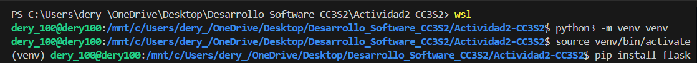
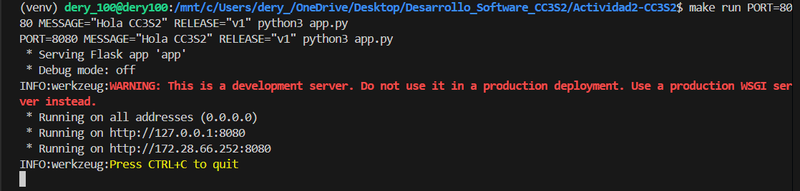
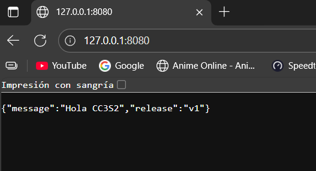

# Actividad 2

#### 1) HTTP: Fundamentos y herramientas

1. **Levanta la app** con variables de entorno (12-Factor):
   `PORT=8080 MESSAGE="Hola CC3S2" RELEASE="v1" python3 app.py` (usa tu *venv*). 

   

   Tambien instale Flask con el comando `pip install flask` y verificar con pip show flask
   
    Levantamos la aplicacion con `make run`:

    

    verificamos:

    