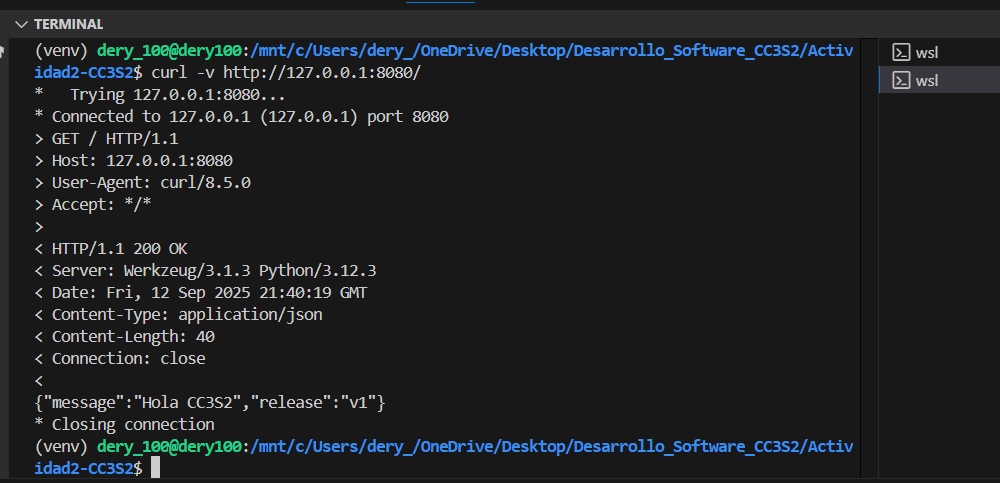
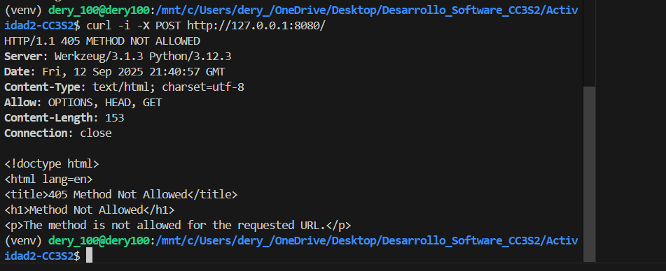
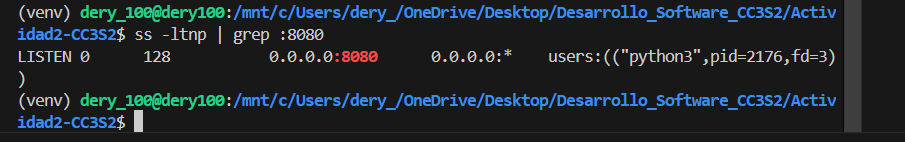
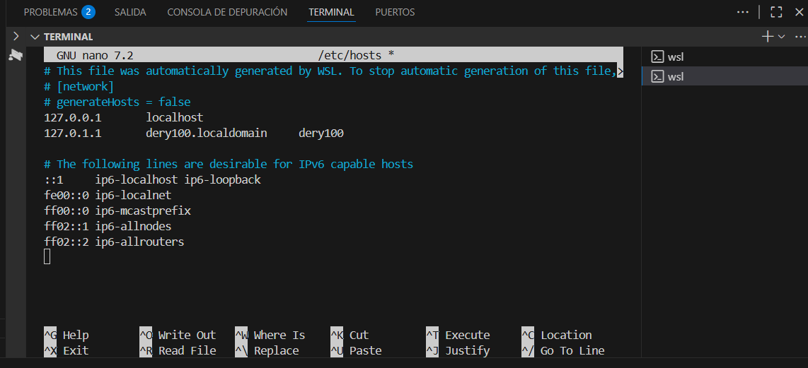
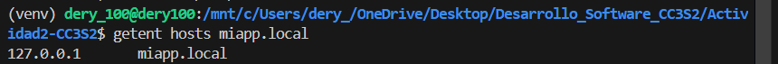
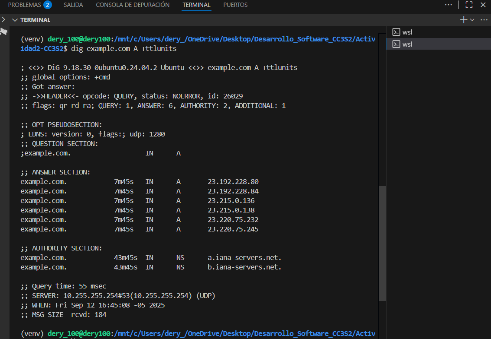

# Actividad 2


### 1) HTTP: Fundamentos y herramientas

1. **Levanta la app** con variables de entorno (12-Factor):  
   Se usó el comando:
   
   PORT=8080 MESSAGE="Hola CC3S2" RELEASE="v1" python3 app.py
   
   

   También se instaló Flask con:
   
   pip install flask
   
   La aplicación se levantó con `make run`:
   
   


2. **Inspección con `curl`:**  
   Verificamos la respuesta con curl:

   ```
   curl -v http://127.0.0.1:8080/
   curl -i -X POST http://127.0.0.1:8080/
   ```
   - GET muestra el JSON esperado:
     
     

   **Pregunta guía:**  
   Los campos de respuesta cambian solo si se reinicia el proceso con nuevos valores de las variables de entorno. Esto ocurre porque Flask lee las variables al iniciar.

3. **Puertos abiertos con `ss`:**  
   Se verificó el puerto con:
   ```
   ss -ltnp | grep :8080
   ```
   

4. **Logs como flujo:**  


### 2) DNS: nombres, registros y caché

1. **Hosts local:**  
   Se editó `/etc/hosts` y se agregó:

   
   
   ```
   127.0.0.1 miapp.local
   ```
   


2. **TTL/caché (conceptual):**  
   Se usó:
   ```
   dig example.com A +ttlunits
   ```
   

   El TTL indica cuánto tiempo se almacena la respuesta en caché. Si repites la consulta antes de que expire el TTL, la respuesta se obtiene más rápido desde la caché.

3. **Pregunta guía:**  
   La diferencia entre `/etc/hosts` y una zona DNS autoritativa es que `hosts` es local y manual, útil para pruebas, mientras que DNS autoritativo es global y gestionado por servidores. `hosts` sirve en laboratorio porque permite simular nombres sin infraestructura real.

---


